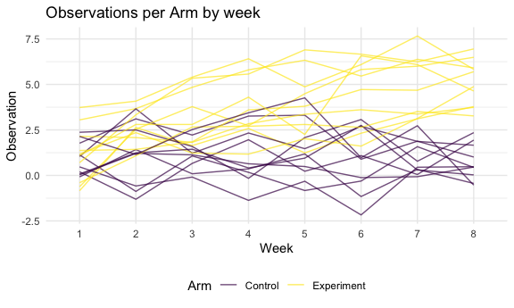
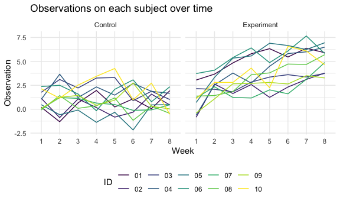
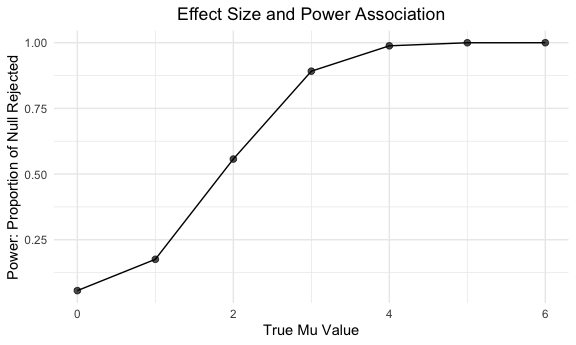
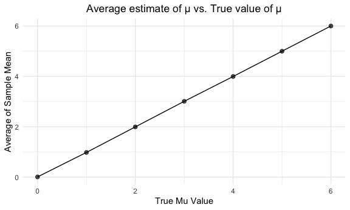
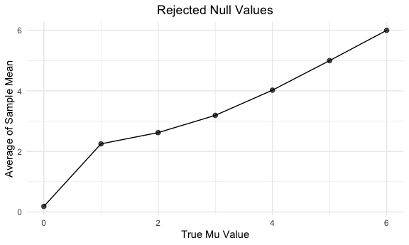

Homework 5
================
JR Chansakul
2020-11-18

## Problem 1

Read in the data.

``` r
homicide_df = 
  read_csv("./data/homicide-data.csv") %>% 
  mutate(
    city_state = str_c(city, state, sep = "_"),
    resolved = case_when(
      disposition == "Closed without arrest" ~ "unsolved",
      disposition == "Open/No arrest"        ~ "unsolved",
      disposition == "Closed by arrest"      ~ "solved",
    )
  ) %>% 
  select(city_state, resolved) %>% 
  filter(city_state != "Tulsa_AL")
```

    ## Parsed with column specification:
    ## cols(
    ##   uid = col_character(),
    ##   reported_date = col_double(),
    ##   victim_last = col_character(),
    ##   victim_first = col_character(),
    ##   victim_race = col_character(),
    ##   victim_age = col_character(),
    ##   victim_sex = col_character(),
    ##   city = col_character(),
    ##   state = col_character(),
    ##   lat = col_double(),
    ##   lon = col_double(),
    ##   disposition = col_character()
    ## )

Let’s look at this a bit

``` r
aggregate_df = 
  homicide_df %>% 
  group_by(city_state) %>% 
  summarize(
    hom_total = n(),
    hom_unsolved = sum(resolved == "unsolved")
  )
```

    ## `summarise()` ungrouping output (override with `.groups` argument)

Can I do a prop test for a single city?

``` r
prop.test(
  aggregate_df %>% filter(city_state == "Baltimore_MD") %>% pull(hom_unsolved), 
  aggregate_df %>% filter(city_state == "Baltimore_MD") %>% pull(hom_total)) %>% 
  broom::tidy()
```

    ## # A tibble: 1 x 8
    ##   estimate statistic  p.value parameter conf.low conf.high method    alternative
    ##      <dbl>     <dbl>    <dbl>     <int>    <dbl>     <dbl> <chr>     <chr>      
    ## 1    0.646      239. 6.46e-54         1    0.628     0.663 1-sample… two.sided

Try to iterate ……..

``` r
results_df = 
  aggregate_df %>% 
  mutate(
    prop_tests = map2(.x = hom_unsolved, .y = hom_total, ~prop.test(x = .x, n = .y)),
    tidy_tests = map(.x = prop_tests, ~broom::tidy(.x))
  ) %>% 
  select(-prop_tests) %>% 
  unnest(tidy_tests) %>% 
  select(city_state, estimate, conf.low, conf.high)
```

``` r
results_df %>% 
  mutate(city_state = fct_reorder(city_state, estimate)) %>% 
  ggplot(aes(x = city_state, y = estimate)) +
  geom_point() + 
  geom_errorbar(aes(ymin = conf.low, ymax = conf.high)) + 
  theme(axis.text.x = element_text(angle = 90, vjust = 0.5, hjust = 1))
```


``` r
city_prop_test = function(df) {
  
  prop.test(.....)
  
}
homicide_df = 
  read_csv("data/homicide-data.csv") %>% 
  mutate(
    city_state = str_c(city, state, sep = "_"),
    resolved = case_when(
      disposition == "Closed without arrest" ~ "unsolved",
      disposition == "Open/No arrest"        ~ "unsolved",
      disposition == "Closed by arrest"      ~ "solved",
    )
  ) %>% 
  select(city_state, resolved) %>% 
  filter(city_state != "Tulsa_AL") %>% 
  nest(data = resolved)
```

    ## Parsed with column specification:
    ## cols(
    ##   uid = col_character(),
    ##   reported_date = col_double(),
    ##   victim_last = col_character(),
    ##   victim_first = col_character(),
    ##   victim_race = col_character(),
    ##   victim_age = col_character(),
    ##   victim_sex = col_character(),
    ##   city = col_character(),
    ##   state = col_character(),
    ##   lat = col_double(),
    ##   lon = col_double(),
    ##   disposition = col_character()
    ## )

# Problem 2

### Dataset Description:

This dataset contains information from a longitudinal study that
included a control arm and an experimental arm. Data for each
participant is included in a separate file, and file names include the
subject ID and arm. The ‘map’ function was used to iterate and read in
all of the Excel files from the zipped folder.

Create a dataframe containing all file names, tidy the result, an d
manipulate file names to include control arm and subject ID. Ensured
weekly observations are “tidy”.

``` r
long_df = 
  tibble(
    path = list.files(path = "./lda_data")) %>%
 mutate(
   data = map(.x = str_c("lda_data/", path), ~read_csv(.x))
    ) %>% 
unnest(data) %>% 
separate(path, into = c("Arm", "ID", "csv")) %>%
  pivot_longer(
    week_1:week_8,
    names_to = "Week",
    names_prefix = "week_",
    values_to = "Observation"
    ) %>% 
select(-csv) %>% 
mutate(
  Arm = str_replace(Arm, "con", "Control"),
  Arm = str_replace(Arm, "exp", "Experiment")
  ) %>% 
arrange(Arm, ID)
```

    ## Parsed with column specification:
    ## cols(
    ##   week_1 = col_double(),
    ##   week_2 = col_double(),
    ##   week_3 = col_double(),
    ##   week_4 = col_double(),
    ##   week_5 = col_double(),
    ##   week_6 = col_double(),
    ##   week_7 = col_double(),
    ##   week_8 = col_double()
    ## )
    ## Parsed with column specification:
    ## cols(
    ##   week_1 = col_double(),
    ##   week_2 = col_double(),
    ##   week_3 = col_double(),
    ##   week_4 = col_double(),
    ##   week_5 = col_double(),
    ##   week_6 = col_double(),
    ##   week_7 = col_double(),
    ##   week_8 = col_double()
    ## )
    ## Parsed with column specification:
    ## cols(
    ##   week_1 = col_double(),
    ##   week_2 = col_double(),
    ##   week_3 = col_double(),
    ##   week_4 = col_double(),
    ##   week_5 = col_double(),
    ##   week_6 = col_double(),
    ##   week_7 = col_double(),
    ##   week_8 = col_double()
    ## )
    ## Parsed with column specification:
    ## cols(
    ##   week_1 = col_double(),
    ##   week_2 = col_double(),
    ##   week_3 = col_double(),
    ##   week_4 = col_double(),
    ##   week_5 = col_double(),
    ##   week_6 = col_double(),
    ##   week_7 = col_double(),
    ##   week_8 = col_double()
    ## )
    ## Parsed with column specification:
    ## cols(
    ##   week_1 = col_double(),
    ##   week_2 = col_double(),
    ##   week_3 = col_double(),
    ##   week_4 = col_double(),
    ##   week_5 = col_double(),
    ##   week_6 = col_double(),
    ##   week_7 = col_double(),
    ##   week_8 = col_double()
    ## )
    ## Parsed with column specification:
    ## cols(
    ##   week_1 = col_double(),
    ##   week_2 = col_double(),
    ##   week_3 = col_double(),
    ##   week_4 = col_double(),
    ##   week_5 = col_double(),
    ##   week_6 = col_double(),
    ##   week_7 = col_double(),
    ##   week_8 = col_double()
    ## )
    ## Parsed with column specification:
    ## cols(
    ##   week_1 = col_double(),
    ##   week_2 = col_double(),
    ##   week_3 = col_double(),
    ##   week_4 = col_double(),
    ##   week_5 = col_double(),
    ##   week_6 = col_double(),
    ##   week_7 = col_double(),
    ##   week_8 = col_double()
    ## )
    ## Parsed with column specification:
    ## cols(
    ##   week_1 = col_double(),
    ##   week_2 = col_double(),
    ##   week_3 = col_double(),
    ##   week_4 = col_double(),
    ##   week_5 = col_double(),
    ##   week_6 = col_double(),
    ##   week_7 = col_double(),
    ##   week_8 = col_double()
    ## )
    ## Parsed with column specification:
    ## cols(
    ##   week_1 = col_double(),
    ##   week_2 = col_double(),
    ##   week_3 = col_double(),
    ##   week_4 = col_double(),
    ##   week_5 = col_double(),
    ##   week_6 = col_double(),
    ##   week_7 = col_double(),
    ##   week_8 = col_double()
    ## )
    ## Parsed with column specification:
    ## cols(
    ##   week_1 = col_double(),
    ##   week_2 = col_double(),
    ##   week_3 = col_double(),
    ##   week_4 = col_double(),
    ##   week_5 = col_double(),
    ##   week_6 = col_double(),
    ##   week_7 = col_double(),
    ##   week_8 = col_double()
    ## )
    ## Parsed with column specification:
    ## cols(
    ##   week_1 = col_double(),
    ##   week_2 = col_double(),
    ##   week_3 = col_double(),
    ##   week_4 = col_double(),
    ##   week_5 = col_double(),
    ##   week_6 = col_double(),
    ##   week_7 = col_double(),
    ##   week_8 = col_double()
    ## )
    ## Parsed with column specification:
    ## cols(
    ##   week_1 = col_double(),
    ##   week_2 = col_double(),
    ##   week_3 = col_double(),
    ##   week_4 = col_double(),
    ##   week_5 = col_double(),
    ##   week_6 = col_double(),
    ##   week_7 = col_double(),
    ##   week_8 = col_double()
    ## )
    ## Parsed with column specification:
    ## cols(
    ##   week_1 = col_double(),
    ##   week_2 = col_double(),
    ##   week_3 = col_double(),
    ##   week_4 = col_double(),
    ##   week_5 = col_double(),
    ##   week_6 = col_double(),
    ##   week_7 = col_double(),
    ##   week_8 = col_double()
    ## )
    ## Parsed with column specification:
    ## cols(
    ##   week_1 = col_double(),
    ##   week_2 = col_double(),
    ##   week_3 = col_double(),
    ##   week_4 = col_double(),
    ##   week_5 = col_double(),
    ##   week_6 = col_double(),
    ##   week_7 = col_double(),
    ##   week_8 = col_double()
    ## )
    ## Parsed with column specification:
    ## cols(
    ##   week_1 = col_double(),
    ##   week_2 = col_double(),
    ##   week_3 = col_double(),
    ##   week_4 = col_double(),
    ##   week_5 = col_double(),
    ##   week_6 = col_double(),
    ##   week_7 = col_double(),
    ##   week_8 = col_double()
    ## )
    ## Parsed with column specification:
    ## cols(
    ##   week_1 = col_double(),
    ##   week_2 = col_double(),
    ##   week_3 = col_double(),
    ##   week_4 = col_double(),
    ##   week_5 = col_double(),
    ##   week_6 = col_double(),
    ##   week_7 = col_double(),
    ##   week_8 = col_double()
    ## )
    ## Parsed with column specification:
    ## cols(
    ##   week_1 = col_double(),
    ##   week_2 = col_double(),
    ##   week_3 = col_double(),
    ##   week_4 = col_double(),
    ##   week_5 = col_double(),
    ##   week_6 = col_double(),
    ##   week_7 = col_double(),
    ##   week_8 = col_double()
    ## )
    ## Parsed with column specification:
    ## cols(
    ##   week_1 = col_double(),
    ##   week_2 = col_double(),
    ##   week_3 = col_double(),
    ##   week_4 = col_double(),
    ##   week_5 = col_double(),
    ##   week_6 = col_double(),
    ##   week_7 = col_double(),
    ##   week_8 = col_double()
    ## )
    ## Parsed with column specification:
    ## cols(
    ##   week_1 = col_double(),
    ##   week_2 = col_double(),
    ##   week_3 = col_double(),
    ##   week_4 = col_double(),
    ##   week_5 = col_double(),
    ##   week_6 = col_double(),
    ##   week_7 = col_double(),
    ##   week_8 = col_double()
    ## )
    ## Parsed with column specification:
    ## cols(
    ##   week_1 = col_double(),
    ##   week_2 = col_double(),
    ##   week_3 = col_double(),
    ##   week_4 = col_double(),
    ##   week_5 = col_double(),
    ##   week_6 = col_double(),
    ##   week_7 = col_double(),
    ##   week_8 = col_double()
    ## )

``` r
long_df
```

    ## # A tibble: 160 x 4
    ##    Arm     ID    Week  Observation
    ##    <chr>   <chr> <chr>       <dbl>
    ##  1 Control 01    1            0.2 
    ##  2 Control 01    2           -1.31
    ##  3 Control 01    3            0.66
    ##  4 Control 01    4            1.96
    ##  5 Control 01    5            0.23
    ##  6 Control 01    6            1.09
    ##  7 Control 01    7            0.05
    ##  8 Control 01    8            1.94
    ##  9 Control 02    1            1.13
    ## 10 Control 02    2           -0.88
    ## # … with 150 more rows

### Spaghetti Plot:

Make a spaghetti plot showing observations on each subject over time,
and comment on differences between groups.

``` r
spag_plot = 
  long_df %>% 
  ggplot(aes(x = Week, y = Observation, group = interaction(Arm, ID), color = Arm)) + 
  geom_line(alpha=0.7) + 
  labs(
    x = "Week",
    y = "Observation",
    title = "Observations per Arm by week"
  )

spag_plot1 = 
  long_df %>% 
  ggplot(aes(x = Week, y = Observation,color = ID)) +
  geom_line(aes(group = ID)) +
  facet_grid(.~Arm) +
  labs(
    title = "Observations on each subject over time",
    x = "Week",
    y = "Observation"
  )

spag_plot
```



``` r
spag_plot1 
```



The observations in the experiment group rose over the study period,
while the observations in the control group remained the same. The
difference in observations between the experiment group and the control
group became apparent at the week 2 time points. Generally, the control
group had fewer observation values compared to the experimental group.

# Problem 3

### Part 1

``` r
set.seed(45)

sim_t_test = function(sample_size = 30, mu = 0, sigma = 5){
  
  sim_data = 
    tibble(
      x = rnorm(sample_size, mean = mu, sd = sigma)
    )
  
  sim_data %>%
  t.test(mu = 0, conf.level = 0.95) %>%
  broom::tidy() %>% 
  select(estimate, p.value)
}
```

``` r
results =
  rerun(5000, sim_t_test()) %>% 
  bind_rows() %>% 
  view
```

### Part 2

``` r
results_2 =
  tibble(
    mu = c(0:6)
  ) %>% 
  mutate(
    output_lists = map(.x = mu, ~ rerun(5000, sim_t_test(mu = .x))),
    est_df = map(output_lists, bind_rows)
  ) %>% 
  select(-output_lists) %>% 
  unnest(est_df)

results_2 %>% view
```

### Part 3

Make a plot showing the proportion of times the null was rejected (the
power of the test) on the y axis and the true value of μ on the x axis.
Describe the association between effect size and power.

``` r
results_df2 =
results_2 %>% 
  group_by(mu) %>% 
  mutate(
    pvalue_rej = case_when(
      p.value < 0.05 ~ "Reject Null",
      p.value > 0.05 ~ "Fail to Reject Null")
    )
    
Plot1 = results_df2 %>% 
  group_by(mu) %>% 
  summarise(
    reject = sum(p.value < 0.05),
    total = n(),
    proportion = reject/total) %>% 
  ggplot(aes(x = mu, y = proportion)) + 
  geom_point(alpha = 0.7, size = 2) +
  geom_line() +
  labs(
    title = "Effect Size and Power Association",
    x = "True Mu Value",
    y = "Power: Proportion of Null Rejected"
  ) + 
  theme(plot.title = element_text(hjust = 0.5))
```

    ## `summarise()` ungrouping output (override with `.groups` argument)

``` r
Plot1
```



From observing the plot, as effect size (True μ) increases, power also
increases.

Plot the average estimate of the sample mean on the y axis and the true
population mean on the x-axis.

``` r
Plot2 = results_df2 %>%
  group_by(mu) %>%
  summarize(
    avg_est = mean(estimate)
  ) %>% 
  ggplot(aes(x = mu, y = avg_est)) + 
  geom_point(alpha = 0.7, size = 2) +
  geom_line() +
  labs(
    title = "Average estimate of μ vs. True value of μ",
    x = "True Mu Value",
    y = "Average of Sample Mean"
  ) + 
  theme(plot.title = element_text(hjust = 0.5))
```

    ## `summarise()` ungrouping output (override with `.groups` argument)

``` r
Plot2 
```



Make a plot on the average estimate of μ̂ only in samples for which the
null was rejected on the y axis and the true value of μ on the x axis.

``` r
Plot3 =
  results_df2 %>% 
  group_by(mu) %>%
  filter(pvalue_rej == "Reject Null") %>% 
 summarize(
    avg_est = mean(estimate)
  ) %>% 
  ggplot(aes(x = mu, y = avg_est)) + 
  geom_point(alpha = 0.7, size = 2) +
  geom_line() +
  labs(
    title = "Rejected Null Values",
    x = "True Mu Value",
    y = "Average of Sample Mean"
  ) + 
  theme(plot.title = element_text(hjust = 0.5))
```

    ## `summarise()` ungrouping output (override with `.groups` argument)

``` r
Plot3
```



``` r
Plot2 + Plot3
```


We found that the sample average of mu is not equal to the true mu
across tests for which the null is rejected, however when the effect
size increases (between 4 and 6), the sample average of mu is
approximately equal to the true mu. When the effect size is small (\<
2), then the ample average of mu seems to overestimate the true mu. For
simulating large sample means (e.g 5 and 6), we have greater power and
therefore a higher likelihood finding evidence to reject the null. When
simulating small sample means (e.g. 1 and 2), we are more likely to draw
samples that are closer to the null distribution (mu=0) and therefore
have less power and a lower chance of rejecting the null hypothesis,.
